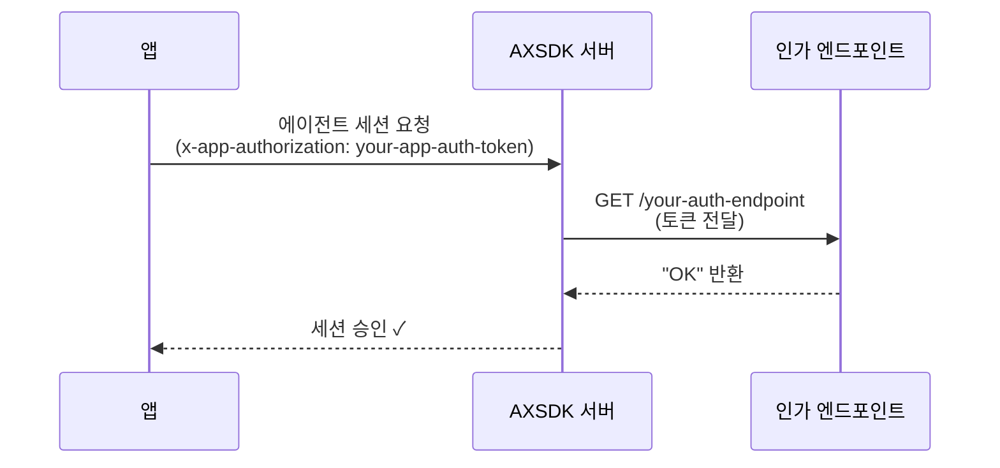

# 앱 인가 (App Authorization)

## 개요

AXSDK를 사용하는 앱은 일반적으로 인터넷에 공개되어 있기 때문에, 자동화된 트래픽, 봇, 악의적인 사용에 노출될 수 있습니다. AXSDK는 기본적으로 **속도 제한(rate limiting)**을 적용하고 있지만, 이것만으로는 충분하지 않을 수 있습니다.

더 강력한 보안을 위해 AXSDK는 **앱 인가(App Authorization)** 기능을 제공합니다. 이 기능을 통해 에이전트 세션 요청이 처리되기 전에 자체 백엔드에서 모든 요청을 검증할 수 있습니다.

---

## 설정

앱 인가를 활성화하려면, AXSDK 웹 콘솔의 **앱 설정(App Settings)** 페이지로 이동하여 **App Authorization** 섹션을 찾으세요.

다음 항목을 설정합니다:

| 항목 | 설명 |
|---|---|
| `authorization endpoint` | AXSDK가 각 요청을 인가할 때 호출할 백엔드 엔드포인트 URL입니다. |
| `enable authorization` | 해당 앱에 대해 앱 인가를 활성화하는 토글입니다. |

!!! tip "인가 엔드포인트 보안"
    인가 엔드포인트에 추가 보호가 필요한 경우 (예: IP 화이트리스팅), [문의하기](mailto:support@layorixinc.com)를 통해 연락주시면 설정을 도와드리겠습니다.

---

## 클라이언트 설정

웹 콘솔에서 앱 인가를 구성한 후, 앱에서 [`AXSDK.setAppAuthToken()`](https://github.com/layorixinc/axsdk-sdk-js)을 호출하여 모든 요청에 함께 전송될 토큰을 설정합니다:

```javascript
AXSDK.setAppAuthToken("your-app-auth-token");
```

이 호출은 AXSDK를 통해 전송되는 **모든 요청**의 HTTP 헤더에 `x-app-authorization` 값을 설정합니다.

---

## 동작 방식

다음 다이어그램은 인가 처리 흐름을 보여줍니다:



1. 앱이 `x-app-authorization` 헤더와 함께 AXSDK를 통해 요청을 전송합니다.
2. AXSDK 서버가 인가 토큰을 설정된 엔드포인트로 전달합니다.
3. 엔드포인트가 토큰을 검증하고 응답합니다.
4. 엔드포인트가 정확히 `OK`를 반환한 경우에만 AXSDK 서버가 요청을 처리합니다.

---

## 인가 엔드포인트 요구사항

인가 엔드포인트는 다음 조건을 만족해야 합니다:

!!! success "성공 응답"
    요청을 허용하려면 HTTP `200`으로 평문 문자열 `OK`를 반환해야 합니다.

    ```
    OK
    ```

!!! danger "실패 응답"
    `OK` 이외의 응답이 반환되면 AXSDK 서버는 에이전트 세션 요청을 **거부**합니다.

엔드포인트에서는 API 키 검사, JWT 검증, IP 필터링, 세션 기반 검사 등 필요한 검증 로직을 자유롭게 구현할 수 있습니다.

---

## 요약

| 단계 | 작업 |
|---|---|
| 1 | 웹 콘솔에서 **앱 설정 → App Authorization** 이동 |
| 2 | `authorization endpoint` URL 설정 |
| 3 | 인가 활성화 |
| 4 | 앱에서 `AXSDK.setAppAuthToken("your-app-auth-token")` 호출 |
| 5 | 엔드포인트에서 `OK` 반환 시 요청 허용 |
