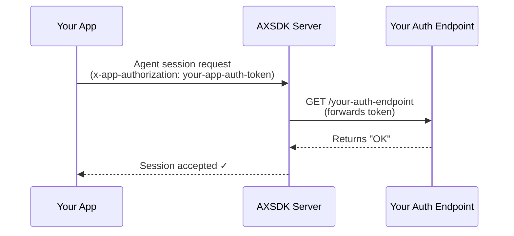

# App Authorization

## Overview

AXSDK-powered apps are generally exposed to the internet, which means they are subject to automated traffic, bots, and potential misuse. While AXSDK applies **rate limiting** by default, this may not be sufficient for all use cases.

For stronger security, AXSDK supports **App Authorization** — a mechanism that lets your own backend validate every Agent session request before it is processed.

---

## Configuration

To enable App Authorization, navigate to your **App Settings** page in the AXSDK web console and locate the **App Authorization** section.

Configure the following fields:

| Field | Description |
|---|---|
| `authorization endpoint` | The URL of your backend endpoint that AXSDK will call to authorize each request. |
| `enable authorization` | Toggle to activate App Authorization for this app. |

!!! tip "Authorization Endpoint Security"
    If your authorization endpoint requires additional protection (e.g., IP whitelisting), please [contact us](mailto:support@layorixinc.com) and we will assist with the configuration.

---

## Client-Side Setup

After configuring App Authorization in the web console, call [`AXSDK.setAppAuthToken()`](https://github.com/layorixinc/axsdk-sdk-js) in your application to provide the token that will be sent with every request:

```javascript
AXSDK.setAppAuthToken("your-app-auth-token");
```

This call sets the `x-app-authorization` HTTP header to the provided token on **every request** sent via AXSDK.

---

## How It Works

The following diagram illustrates the authorization flow:



1. Your app sends a request via AXSDK with the `x-app-authorization` header.
2. The AXSDK server forwards the authorization token to your configured endpoint.
3. Your endpoint validates the token and responds.
4. The AXSDK server proceeds only if your endpoint returns exactly `OK`.

---

## Authorization Endpoint Requirements

Your authorization endpoint must satisfy the following:

!!! success "Successful Response"
    Return the plain text string `OK` (HTTP `200`) to allow the request.

    ```
    OK
    ```

!!! danger "Failed Response"
    Any response other than `OK` will cause the AXSDK server to **reject** the Agent session request.

Your endpoint can implement any validation logic you need — API key checks, JWT validation, IP filtering, session-based checks, etc.

---

## Summary

| Step | Action |
|---|---|
| 1 | Go to **App Settings → App Authorization** in the web console |
| 2 | Set the `authorization endpoint` URL |
| 3 | Enable authorization |
| 4 | Call `AXSDK.setAppAuthToken("your-app-auth-token")` in your app |
| 5 | Your endpoint returns `OK` to allow requests |
